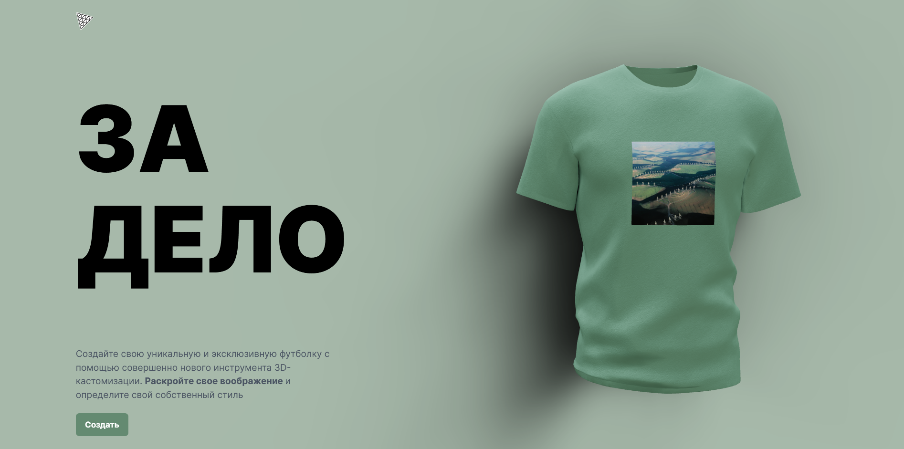

# 3. FuturWear

## О проекте

FuturWear также использует сервер на Node.js и Express для обработки заказов и обработки загруженных пользователем файлов. Также FuturWear позволяет пользователям создавать и заказывать свои собственные уникальные дизайны футболок.

## Функциональность

-   3D-моделирование и создание дизайнов
-   Загрузка своих файлов или использование ИИ
-   Заказ готовых футболок с выбранными дизайнами

## Стэк технологий

-   React
-   Redux
-   TypeScript
-   Three.js
-   Node.js
-   OpenAI API
-   TailwindCSS
-   Framer Motion

## Ссылка: https://futur-wear.vercel.app/
